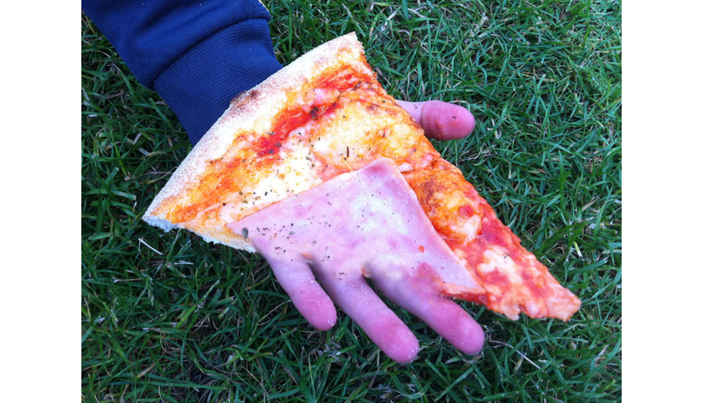
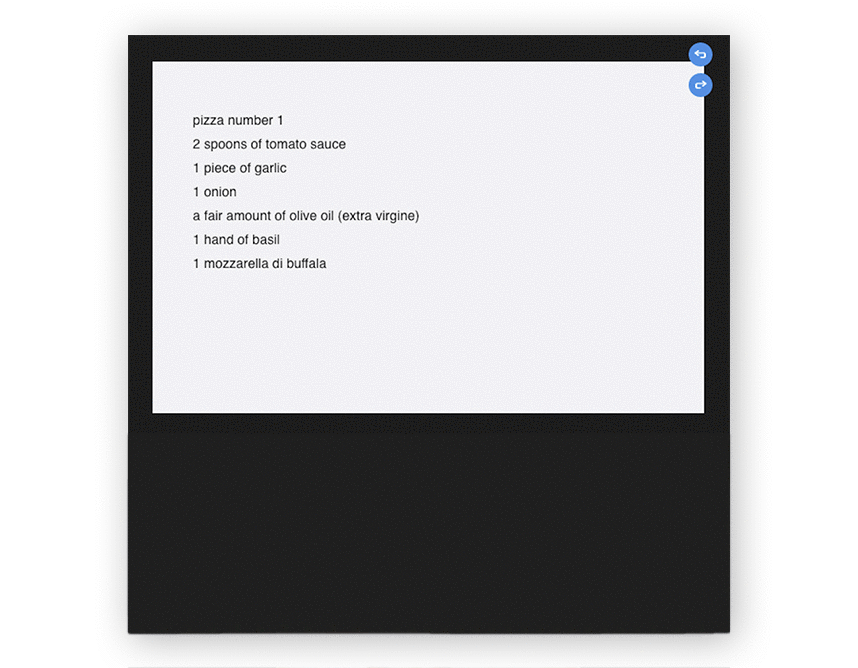
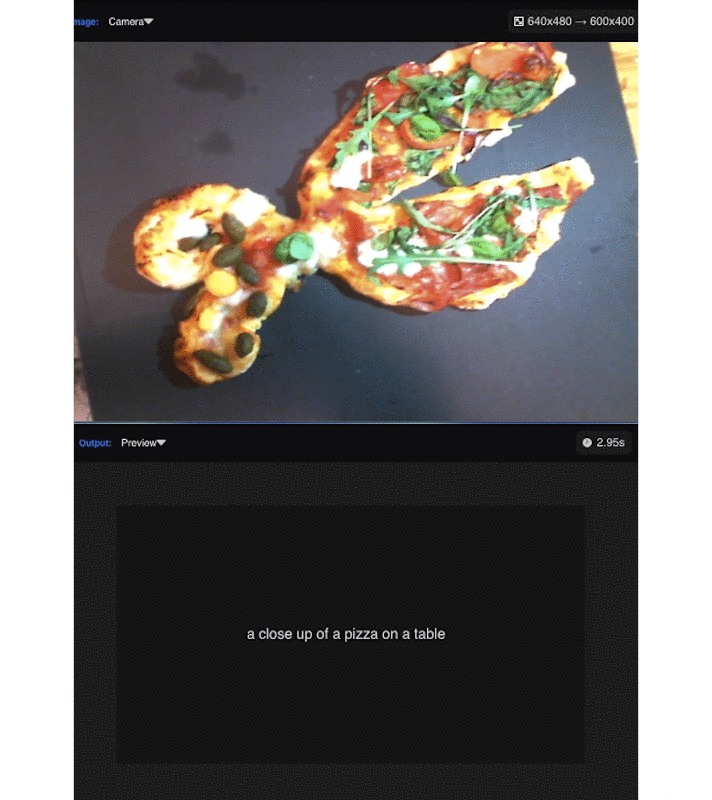
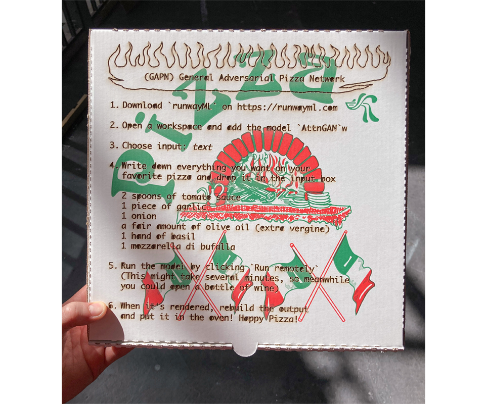

## `(GAPN)` General `Adversarial` Pizza `Network`   

### The idea of the workshop was to explore how it feels when an essential and human thing like food and dining is combined with machine learning.
### We (AI & I) invited some friends to my place. Everyone brought their favorite ingredients and AI & I provided the technical setup.  For the dinner, we used `RunwayML`, an app that has several pre-trained AI which you can use without being an AI expert. 

   
   
   
### workflow:   
### `human input` &nbsp;&nbsp;&nbsp;&nbsp;&nbsp;&nbsp;&nbsp;&nbsp;>  `AI layer 1` &nbsp;&nbsp;&nbsp;&nbsp;&nbsp;&nbsp;&nbsp;&nbsp;> `AI layer 2` &nbsp;&nbsp;&nbsp;&nbsp;&nbsp;&nbsp;&nbsp;&nbsp;>  `.....`  &nbsp;&nbsp;&nbsp;&nbsp;&nbsp;&nbsp;&nbsp;&nbsp; >  `Pizza`   
   
       

### We chose different modes for each pizza:   
   
### `wish2pizza`   
### 1. we write down our favorite pizza ingredients   2. text input gets interpreted into an image   3. we reconfigure the image into a physical pizza .
   

          

### `pizza2text`   
### 1. styling pizzas like objects   2. enforcing AI to generate text based on the picture of th pizza.   
  
   
    

  
### `resume`   
### After the evening, I'd say that humans still prefer human pizza over AI pizza.   Nevertheless we had interesting conversations about the future of AI and the fields in which AI might lead to a more efficent automation like in mass industry food production, take aways and delivery. Here a short recipe:

 

### `resources`   
RunwayML download link: [https://runwayml.com/](https://runwayml.com/)      
for the dow: 400g farina typo 00, 100g semola di grano duro rimacinata, hand of sea salt, a teaspoon olive oil, 10g yeast

