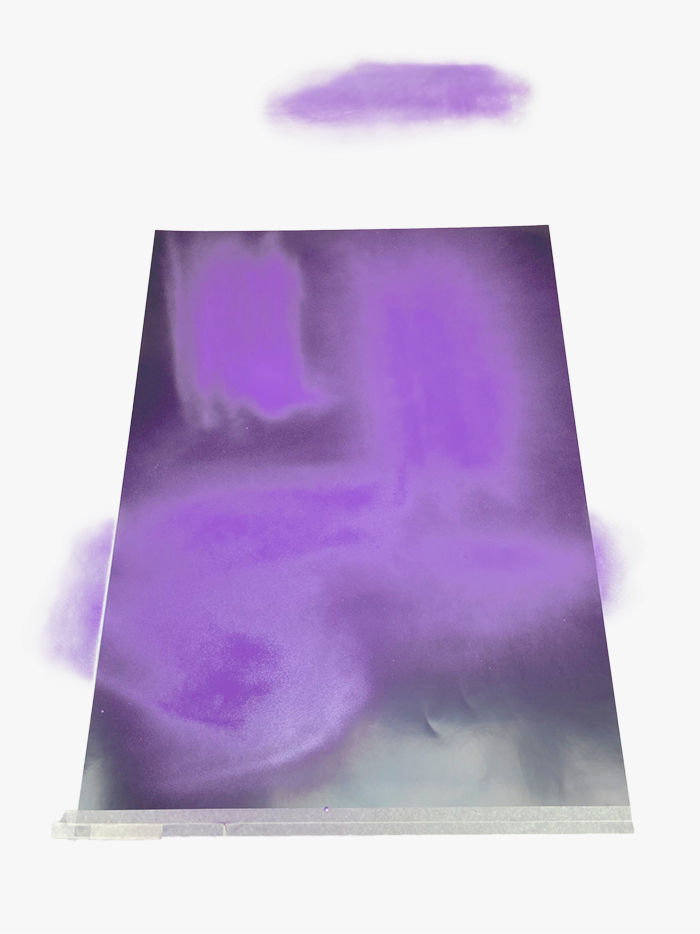
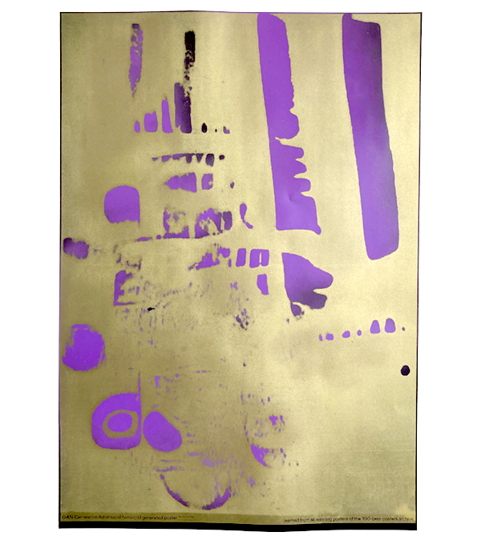
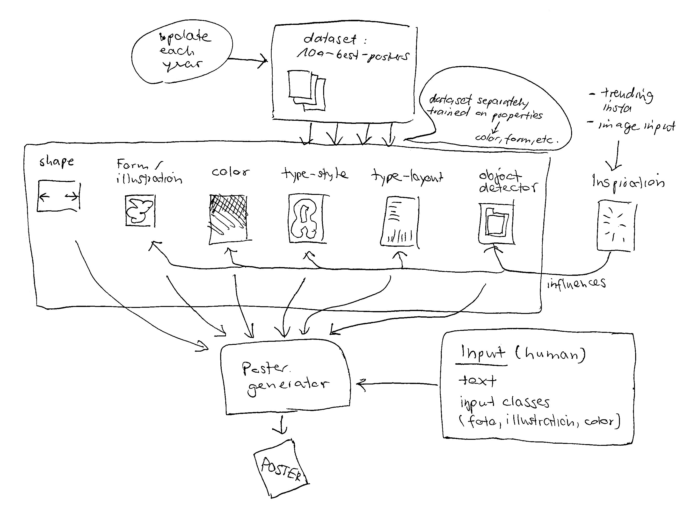

## `101`best`poster`bot

To train to be a poster-design-bot you need a dataset. The contest [100 best posters](https://100-beste-plakate.de/) provides an archive with all of their winner posters – hot design and a clean dataset with images of same size! Perfect!
To download the whole archive, I used an image crawler (see `crawler.py` in the directory).

I collaborated with `styleGAN`, an AI that learns on its own without any labeled data and tries to recognise patterns in the posters. Afterwards it can use these learned patterns to design new posters for us!  
  

## `walkthrough the AI`   [after 5000 training cycles]
    
     

## `image generation + selection + print`
The AI does not provide 1 poster but a range of extremes of what it learned. So I had to choose the poster within this and decided to screenprint it. Afterwards, I handed in the poster for the contest. 

   
   
   

   

## `resume`   
Sadly our poster did not make it in the 100 best. It seemed that it lacked some parameters for judging it properly. The problems of our collaboration are:   1. too random design  2. dataset is too small  3. posters are designed in layers like color, form, typography, humor, inspiration, personal style  4. poster had no informational layer. (announcement to an event)
In the following, I propose a draft of how different artificial intelligences could be used together, to really replace the creative process of designing a poster:

     

## `resources`
runwayML download link (you can train a styleGAN there): [https://runwayml.com/](https://runwayml.com/) 
styleGAN on github:[https://github.com/NVlabs/stylegan2](https://github.com/NVlabs/stylegan2)
