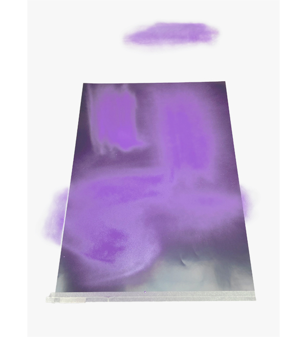

## `101`&nbsp;&nbsp;b`e`s`t` &nbsp;&nbsp; `p`o`s`t`e`r &nbsp;&nbsp; `b`o`t`

### Training an AI to be a poster-design-bot needed a dataset. The contest [100 best posters](https://100-beste-plakate.de/) provide an archive with all of their winner posters – just hot design and a clean dataset with images of same size! perfect!
### To download the whole archive, I used an image crawler (see `crawler.py` in the directory)

### The AI i collaborated with is called `styleGAN`. It learns on its own ("unsupervised") without any classified data and tries to recognise patterns in the posters. Afterwards it can use these learned patterns to design new posters.   
  

### `walkthrough the AI`   (after 5000 generations)
    
     

### `image generation + selection`  `+ print`
### The AI does not give 1 poster but a range of extrems of what it learned so I had to choose the poster, I also decided to screenprint it. Afterwards, I handed in the poster for the contest. 

   
   
   

   

### `conclusion`
### Sadly my poster did not make it in the 100 best. It seemed that it lacked some parameters for judging it properly. The problems of the bot are:   
### 1. too random design  2. dataset is too small  3. posters are designed in layers like color, form, typography, humor, inspiration, personal style  4. poster had no informational layer (announcement to an event)
### In the following, I propose a draft of how different artificial intelligences could be used together, to really replace the creative process of designing a poster:

     

### `resources`
runwayML download link (you can train a styleGAN there): [https://runwayml.com/](https://runwayml.com/) 
styleGAN on github:[https://github.com/NVlabs/stylegan2](https://github.com/NVlabs/stylegan2)
