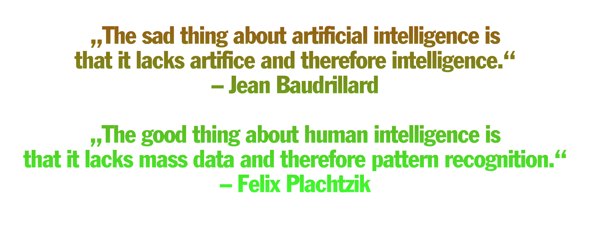
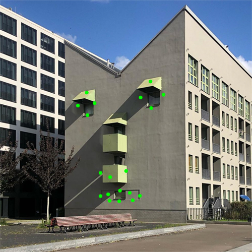

<!---   I N T R O   --->

## `Ai and I` &nbsp; – Machines can see. Now what?      
   
## A joint venture between Artificial Intelligence and me as a designer. Together we form a creative studio to explore new strategies and tools for design in a world of machine learning.   

"*intro bild*"   

The latest developments in the field of artificial intelligence (AI) have caused a huge hype in recent years. The debate about AI is mostly black or white. Either you read about the negative sides like deepfakes copying our identities, the upcoming total surveillance, complete automation or you read about the positive side of infinite possibilities like self driving cars or smart cities.   
The technology is mainly possible because of the large amounts of data we produce. With this data, networks can be trained to recognize patterns and make decisions such as: Which song comes next? What are you likely to vote for? or: you bought X so you're interested in Y?
While AI already influences how the digital world is shown to us and how we consume it – our design techniques remain untouched and the creative potential and visual challenges which will come with AI are left aside because creative jobs are called safe spaces which will not be replaced by AI.   
      
**`AI and I`** is a simulated design studio between me as a designer and artificial intelligence. In a daily work routine, we explore new strategies and tools to deal with the  changing visual world of generated images. We take existing AIs, turn them upside down, misuse them, misunderstand them or we switch perspectives and look how AI sees design.   
This experiment aims to better understand how AI works, how it can be used for design, how it could change design itself and find answer to questions like:   
## **`How does it feel to be in a design collaboration with an artificial intelligence?`**      
## **`Which new perspectives emerge from it?`**   
**`What will be our role as designers if every visual output can and will be used as dataset for machine learning?`**   
**`Will we then only design for datasets instead for humans?`**   
**`What will be our role when networks create 100% generated images?`**   
   

        

<!---   P O S T E R   --->

## `101`best `poster`bot
  

## Each year the contest [100-best-posters from Germany, Austria and Switzerland](http://100-beste-plakate.de/) asks for the best posters. Often, I don't have a poster but I want to win. So I built an AI-intern that learns from all winner posters and designs new ones.  
[go to project](https://github.com/FelixPlastik/AI-and-I/tree/master/101%20best%20poster%20bot) 
        

<!---   P I Z Z A   --->

## `Pizza` e `Gusto`
  

## Dinner workshop with a pizza-chef-AI.   In a ping pong between pizza wish and AI understanding, we explored how it might feel when your pizza order gets interpreted through several machine learning layers.  
[go to project](https://github.com/FelixPlastik/AI-and-I/tree/master/pizza%20e%20gusto)
        

<!---   O B J E K T E   --->

## `things` for `datasets`    
&nbsp;      
    
    

## Series of furnishing objects in a design ping-pong with object detection AI.    
[go to project](https://github.com/FelixPlastik/AI-and-I/tree/master/things%20for%20datasets)   
        

<!---   F E N S T E R   --->

## `place` to `be` 
  

## We humans tend to see faces everywhere and we design faces in everything. I used AI deepfake to make this dream come true for real.
[go to project](seeing-is-believing/README.md)
        

<!---   S O U N D    --->

## `Sounds` like `work` 
  

## 24 hours generic working sounds ambient for a 24/7 design studio.
[go to project](https://github.com/FelixPlastik/AI-and-I/tree/master/sounds%20like%20work)
              

<!---   S T U H L   --->

## `word` chair   

 
    
    

## Assumptions about a wooden chair on a green field.   
[go to project](https://github.com/FelixPlastik/AI-and-I/tree/master/word%20chair)

       
