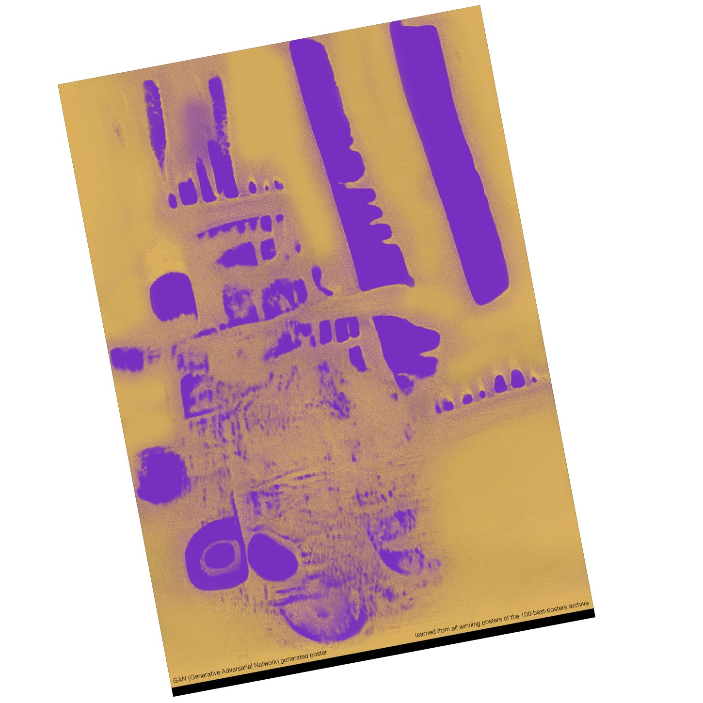
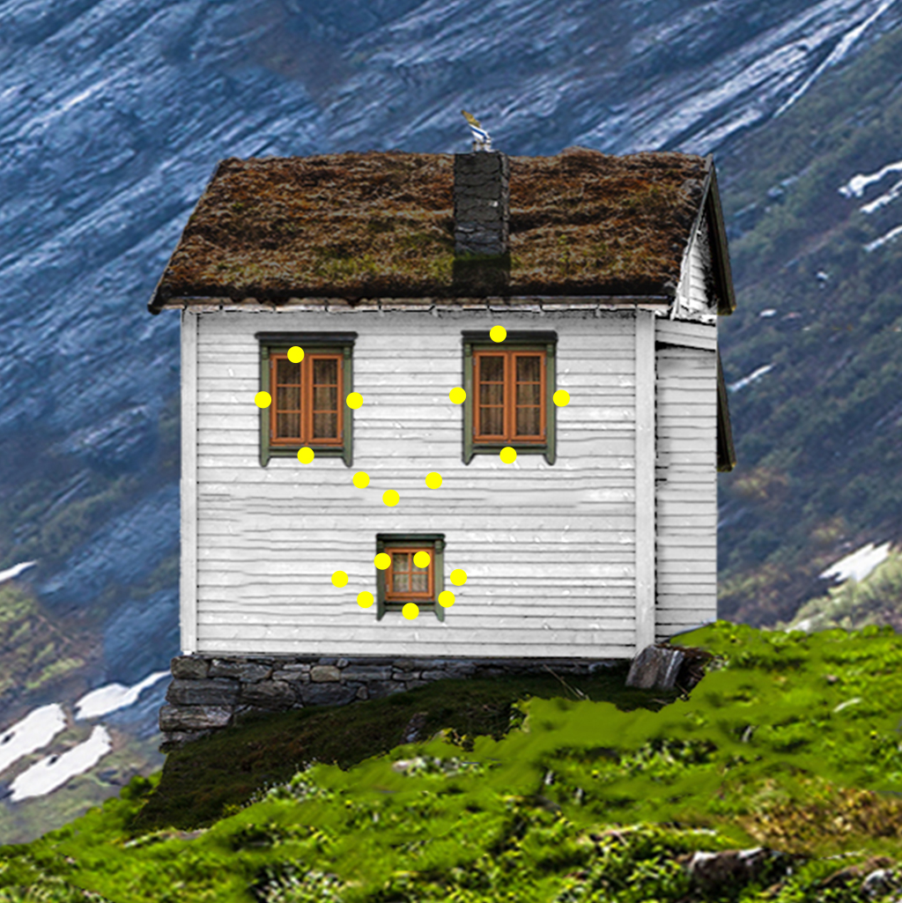

<!---   I N T R O   --->

## `AI and I – Machines can see. Now what?`   
## Artificial intelligence (or AI) have caused a huge hype in recent years. Beside the artificial intelligences which we already use like Siri, personalized recommendations, auto-correction or chatbots, AI is becoming so good in learning and generating images and videos that its getting harder to say what’s real and what is fake. 
## Although AI is silently slipping into the domain of artists and designers and affecting how we see things, we keep our design techniques untouched and the creative potential and visual challenges which will come with AI are left aside.

## `AI and I` is a simulation of a design studio between me as a designer and artificial intelligence. In a daily work routine, we explore new strategies and tools to deal with the changing visual world of generated images. We take existing AIs, turn them upside down, misuse them, misunderstand them or we switch perspectives and look how AI perceives design or not. This experiment aims to better understand how AI works, how it can be used for design, how it could change how we design and search answers to questions like:   
## `How does it feel to be in a design collaboration with an artificial intelligence?`   `Which new perspectives emerge from it?`   `What will be our role as designers when every visual output can and will be used as dataset for machine learning?`    `For whom will we design then?`   `How will our job look like when networks create 100% generated images?`
   

        

<!---   P O S T E R   --->

## `101`best `poster`bot
  

## Each year the contest [100-best-posters from Germany, Austria and Switzerland](http://100-beste-plakate.de/) asks for the best posters. Often, I don't have a poster but I want to win. So I built an AI-intern that learns from all winner posters and designs new ones.  
[go to project](https://github.com/FelixPlastik/AI-and-I/tree/master/101%20best%20poster%20bot) 
        

<!---   P I Z Z A   --->

## `(GAPN)` General `Adversarial` Pizza `Network`
  

## A dinner workshop with served by an AI pizza-chef.   In a ping pong between pizza wish and AI understanding, we explored how it might feel when your pizza order gets interpreted through several machine learning layers.  
[go to project](https://github.com/FelixPlastik/AI-and-I/tree/master/(GAPN)%20General%20Adversarial%20Pizza%20Network)
        

<!---   O B J E K T E   --->

## `things` for `datasets`   
    
    

## Series of furnishing objects in a design ping-pong with object detection AI.    
[go to project](https://github.com/FelixPlastik/AI-and-I/tree/master/things%20for%20datasets)   
        

<!---   F E N S T E R   --->

## `place` to `be` 
  

## We humans tend to see faces everywhere and we design faces in everything. I used AI deepfake to make this dream come true for real.
[go to project](seeing-is-believing/README.md)
        

<!---   S O U N D    --->

## `Sounds` like `work` 
  

## 24 hours generic working sounds ambient for a professional design studio.
[go to project](https://github.com/FelixPlastik/AI-and-I/tree/master/sounds%20like%20work)
              

<!---   S T U H L   --->

## `word` chair   

 
    
    

## Assumptions about a wooden chair on a green field.   
[go to project](https://github.com/FelixPlastik/AI-and-I/tree/master/word%20chair)

       
