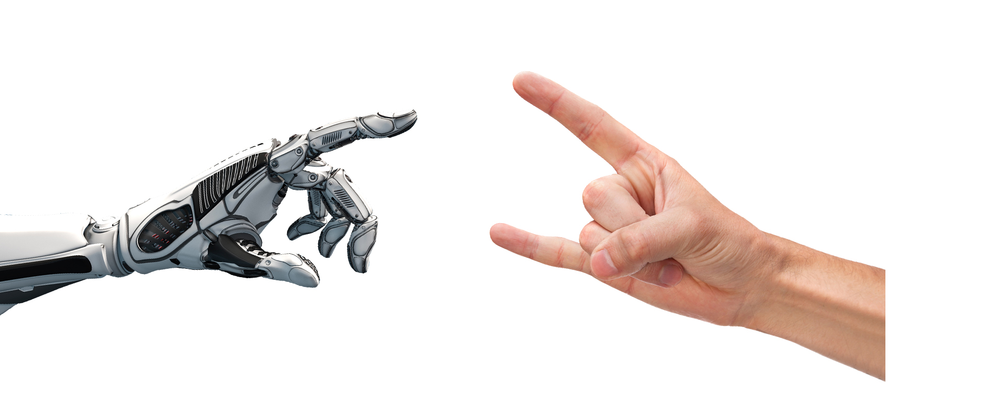
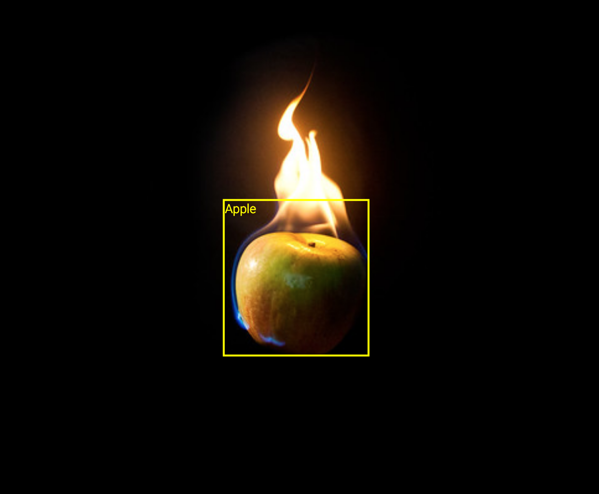

# `A`i `a`n`d` I

`E`x`p`l`o`r`i`n`g` &nbsp; &nbsp; d`e`s`i`g`n` &nbsp; &nbsp; s`t`r`a`t`e`g`i`e`s` &nbsp; &nbsp; &amp; &nbsp; &nbsp; t`o`o`l`s &nbsp; &nbsp; `i`n &nbsp; &nbsp; `a` &nbsp; &nbsp; c`o`l`a`b`o`r`a`t`i`v`e` &nbsp; &nbsp; p`i`n`g`-`p`o`n`g &nbsp; &nbsp; `b`e`t`w`e`e`n` &nbsp; &nbsp; A`r`t`i`f`i`c`i`a`l` &nbsp; &nbsp;  I`n`t`e`l`l`i`g`e`n`c`e` &nbsp; &nbsp; a`n`d &nbsp; &nbsp; `M`e &nbsp; &nbsp; `a`s &nbsp; &nbsp; `a` &nbsp; &nbsp; d`e`s`i`g`n`e`r`.

`Artificial Intelligence (AI)` or `Machine learning` is a pretty hyped theme the last years and I guess to most people including myself, it is totally unclear what the hack it does? when does it come? and most importantly for me: Can I do something with it?

The technology is already here, for now it is mostly subtle so we don't realize it – like the perfect Google Search or weekly spotify recommendations. While AI influences our world (big words 😉) or at least how we consume, our techniques to design remain untouched and creativity is called one of the safe haven for jobs which can not be replaced by AI.
  
- [ ] `how does it feel to design for or with an AI?`
- [ ] `how does AI as a creative partner change my perspective on design?` 
- [ ] `and what new design strategies arise from it?`

The following respository is an ongoing collection of design experiments in collaboration with artificial intelligence.  
The mode always changes, which means sometimes the AI is the designer, sometimes it is me.  
Sometimes it is me against AI and sometimes AI has to approve my design..There are no limits!  
 
   
*If you want to join, please feel free to add your experiment in a pull request or [mail me](mailto:ciao@pl80.cc?subject=[GitHub]AI%20and%20I)*

## 100% detected is 50% designed
  

Objects detection AI is one of the major uses in machine learning since it is way faster and more accurate then any human eye. In this experiment, I used an object recognition AI which is capable to recognize all kinds of objects to design a series of objects that play with AI's recognizability and invisibility of things and its faults. [**-->**](detected-objects/README.md)  
 

## 101-best-poster-bot
Each year the contest [100-best-posters from Germany, Austria and Switzerland](http://100-beste-plakate.de/) asks for the best poster designs. Often, I don't have a poster and there is no time to make a winner poster. But if you don't have a poster you can't win.  
So I built a poster-bot to design only winning posters. [**-->**](101-best-poster-bot/README.md) 
 

## seeing is believing
text
 
 

## nextt
texxt
