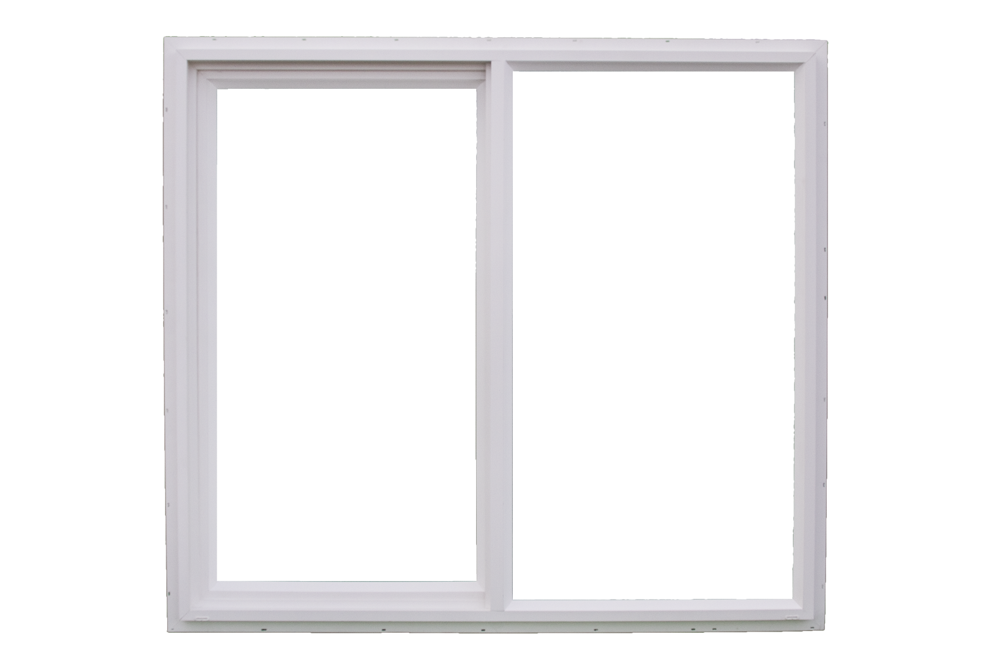

## `Ai` and `I`  
  

## `E`x`p`l`o`r`i`n`g` &nbsp;&nbsp;&nbsp; d`e`s`i`g`n` &nbsp;&nbsp;&nbsp; s`t`r`a`t`e`g`i`e`s` &nbsp; &nbsp; & &nbsp; &nbsp; t`o`o`l`s &nbsp;&nbsp;&nbsp; `i`n &nbsp; &nbsp; `a` &nbsp; &nbsp; c`o`l`a`b`o`r`a`t`i`v`e`&nbsp; &nbsp; p`i`n`g`-`p`o`n`g &nbsp; &nbsp; `b`e`t`w`e`e`n` &nbsp;&nbsp;&nbsp; A`r`t`i`f`i`c`i`a`l` &nbsp;&nbsp;&nbsp;  I`n`t`e`l`l`i`g`e`n`c`e` &nbsp; &nbsp; & &nbsp; &nbsp; `M`e &nbsp; &nbsp; `a`s &nbsp; &nbsp; `a` &nbsp; &nbsp; d`e`s`i`g`n`e`r`.

## `Artificial Intelligence (AI)` and `Machine learning` are pretty hyped themes the last years and I guess to most people including myself, it is totally unclear what the hack it does? when does it strike us? and most importantly: What do I have from it?  

## The technology is already here. For now it is mostly subtle so we don't realize it – like the perfect Google Search or weekly spotify recommendations. While AI influences what we buy, how we consume and how the digital world is shown to us, our design techniques remain untouched and creativity is called one of the safe haven for jobs which can not be replaced by AI.   `How does it feel to design for or with an AI?`   `How does AI as a creative partner change my perspective on design?`   `And which new design strategies emerge from it?`

## In a world of artificially generated content and images, the future will bring a massive challenge for fast adaptation of our senses to this new visual reality as well as a necessary adaptation of our working methods as designers.

## With »AI and I« – a joint venture between Artificial Intelligence and Me as a designer, we overcome this gap and form a new Creative Suite of tools and strategies to distinguish between a S and a snake on the floor again.

## In a daily work routine of a creative studio we (AI and I) try to find creative to overcome this gap and form a new Creative Suite of tools and strategies to distinguish between a S and a snake on the floor.

   
   
   

The following respository shows a collection of design experiments all collaboration with artificial intelligence.  
The mode always changes, which means sometimes the AI is the designer, sometimes it is me.  
Sometimes it is me against AI and sometimes AI has to approve my design..There are no limits!  
*If you want to join with an experiment, want to leave a comment or find an issue: Feel free to add it in a pull request or [mail me](mailto:ciao@pl80.cc?subject=[GitHub]AI%20and%20I)*

    

## `1`0`1`-B`e`s`t`-P`o`s`t`e`r`-B`o`t
  
Each year the contest [100-best-posters from Germany, Austria and Switzerland](http://100-beste-plakate.de/) asks for the best poster designs. Often, I don't have a poster and there is no time to make a winner poster. But if you don't have a poster you can't win.  
So I built a poster-bot to design only winning posters. [&#9166;](101-best-poster-bot/README.md) 
 
    

## `P`i`Z`Z`A` e `G`U`S`T`O`
  

## A dinner workshop in which AI took over the role of the untouchable pizzero. In a ping pong between pizza order and AI understanding, we explored how it might feel when your pizza-wish gets interpreted through several machine learning layers.  
[go to project](seeing-is-believing/README.md)

    

## `100%`detected`is`50%`designed`
  

## Objects recognition AI is one of the major uses in machine learning since it is way faster and more accurate then any human eye. Give it an input image and It is capable to recognize all kinds of objects in it. In this experiment, I used an object recognition AI to design a series of objects that play with the AI's recognizability and invisibility of things and its faults. 
[go to project](detected-objects/README.md)  

    

## `S`e`e`i`n`g &nbsp;&nbsp;`i`s &nbsp;&nbsp;`B`e`l`i`e`v`i`n`g` 
  

## [Deepfake](https://www.youtube.com/watch?v=cQ54GDm1eL0) AIs are increasingly able to capture our faces and use it for any purpose like creating fake campaigns or fake porns. On the other hand our designed environment is deeply inspired by faces like houses or car fronts. Fenster combines both ways 
[go to project](seeing-is-believing/README.md)

    

## `24`h`o`u`r`s &nbsp;&nbsp;`n`a`t`u`r`a`l`&nbsp;&nbsp; w`o`r`k`&nbsp;&nbsp; a`m`b`i`e`n`t 
  

## Perfectly efficent AI trained on working sounds. The working sounds were performed by myself. suggesting the 24/7 open design studio. dont call me at weekend!
[go to project](seeing-is-believing/README.md)

    
