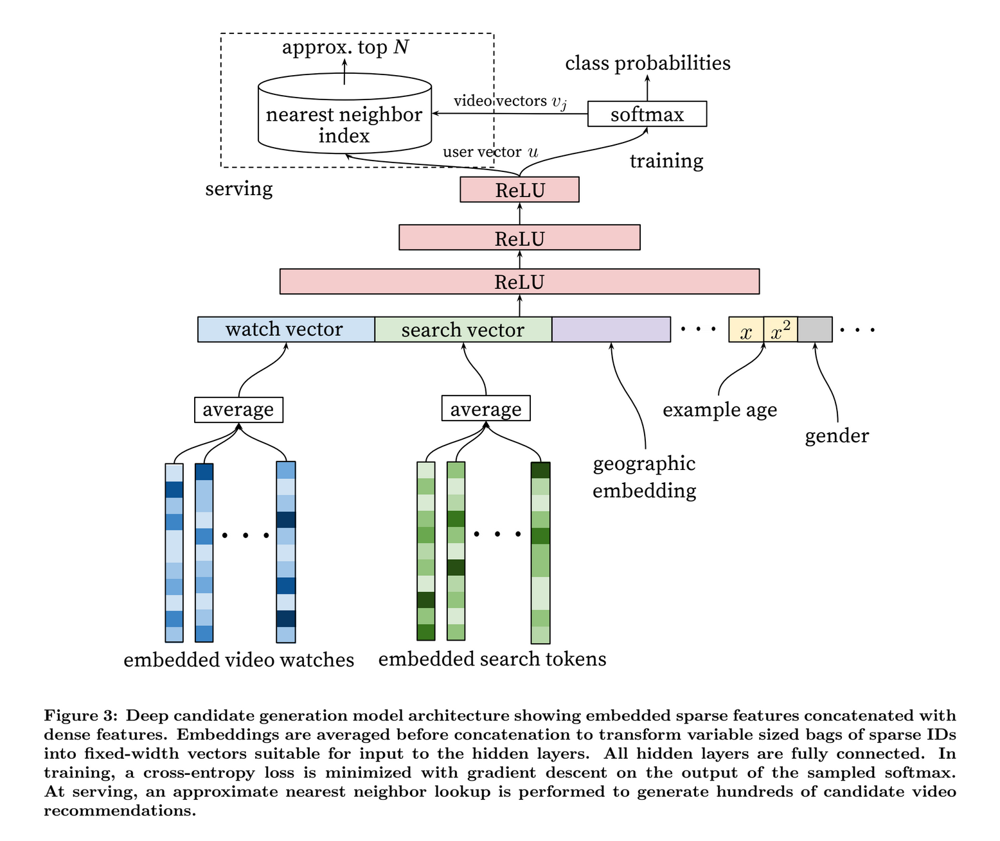

# `p`e`r`f`e`c`t`&nbsp;&nbsp;&nbsp; p`l`a`y`l`i`s`t`

# All streaming platforms (youtube, spotify, soundcloud, netflix,..) work with recommendations   to provide you with the hottest tracks that perfectly match with your taste. The system of "perfect taste" works through inputs like   `your search history`,`your listened history`,`your gender`,`your age`,`your location`,`trending videos`,`new content`. 

# All this is constantly fed to an AI algorythm providing you with the perfect sounds.   `perfect playlist` is the first pure AI playlist for the office. By cutting out any "personalized" disturbances, a fresh youtube account and without any history, the AI is left alone and reveals a glimpse of how a "clean" AI recommends when there is no personalization.

get the
## `perfect`   `playlist`

  
overview, youtube recommendation algorythm ([source](https://towardsdatascience.com/using-deep-neural-networks-to-make-youtube-recommendations-dfc0a1a13d1e))

 
 
 

*Note: A completely bias-free youtube account is impossible. Youtube accounts have to be connected to a Google account, which includes giving at least your age. You can specify your gender with "unspecified" but the algorythm is always optimized to a location. You can select a different language + location in youtube which changes the recommendations indeed. You can also use a VPN service to disguise your IP adress, but then it is connected to the location of the VPN server. So it will always be connected to a location if it is your own or a fake one.*

