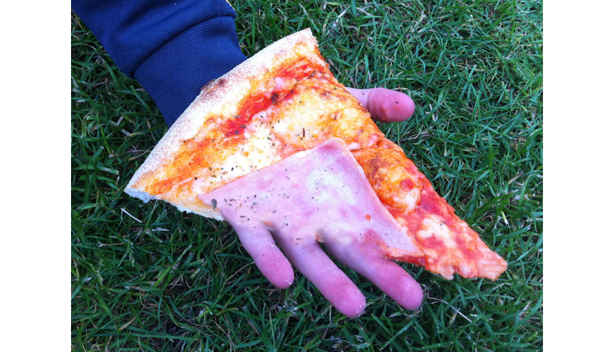
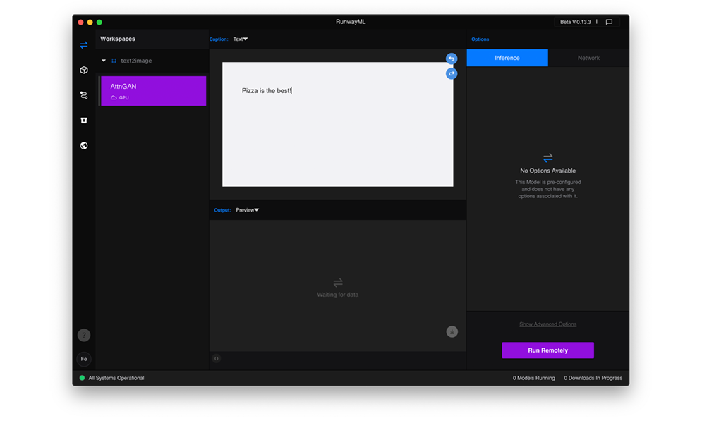

## `P`i`z`z`a` e &nbsp;`G`u`s`t`o`

### Idea of the workshop was to explore how does it feel, when an essential and human thing like food and dining is combined with machine learning?!
### We (AI & I) invited some friends to my place, everybody brought its favorite ingredients and we provided the technical setup.  For the dinner we used `RunwayML`, an app that has several pre-trained AI you can use instantly and without being an AI expert.   

   

### workflow:
### `human input`  &nbsp;&nbsp;&nbsp;&nbsp;&nbsp;&nbsp;&nbsp;&nbsp;>  `AI layer 1` &nbsp;&nbsp;&nbsp;&nbsp;&nbsp;&nbsp;&nbsp;&nbsp;>  `AI layer 2` &nbsp;&nbsp;&nbsp;&nbsp;&nbsp;&nbsp;&nbsp;&nbsp;>  `.....`  &nbsp;&nbsp;&nbsp;&nbsp;&nbsp;&nbsp;&nbsp;&nbsp;>  `output` &nbsp;&nbsp;&nbsp;&nbsp;&nbsp;&nbsp;&nbsp;&nbsp;>  `Pizza`  
   
   

### `txt2pizza`
> pic
### `img2text2pizza`
> pic
### `face2pizza`
> pic

### conclusion

### resources   
RunwayML download link: [https://runwayml.com/](https://runwayml.com/)     

