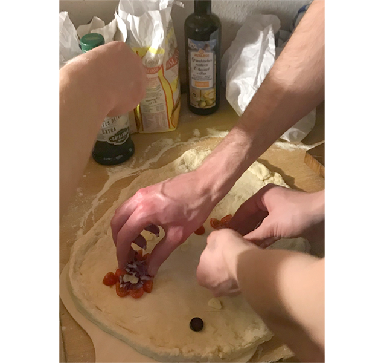
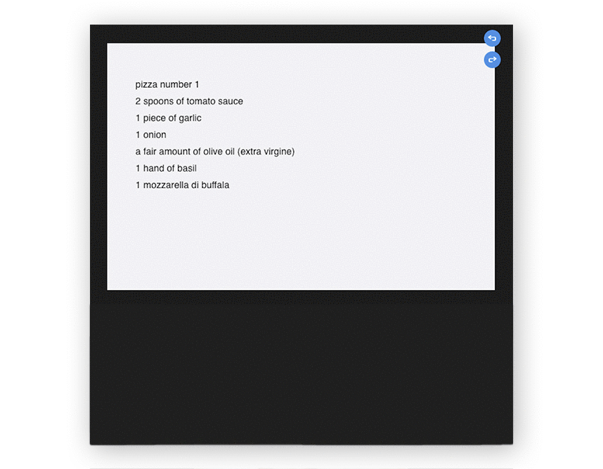
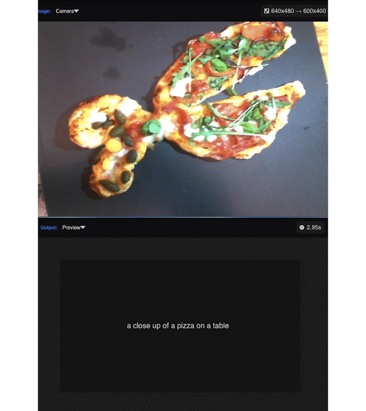
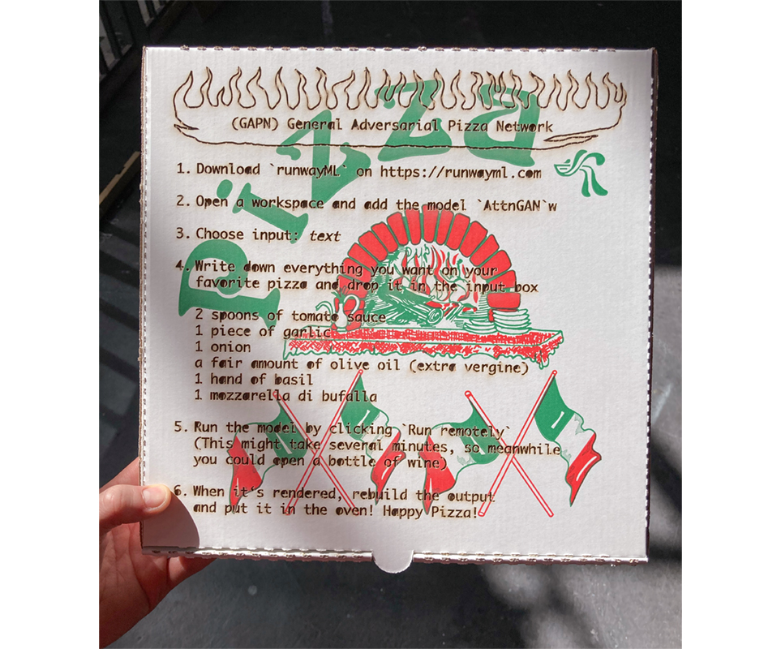

## `(GAPN)`&nbsp;&nbsp;G`e`n`e`r`a`l &nbsp;&nbsp; `A`d`v`e`r`s`a`r`i`a`l`&nbsp;&nbsp;   P`i`z`z`a &nbsp;&nbsp;`N`e`t`w`o`r`k`

### Idea of the workshop was to explore how does it feel, when an essential and human thing like food and dining is combined with machine learning?!
### We (AI & I) invited some friends to my place, everybody brought its favorite ingredients and we provided the technical setup.  For the dinner we used `RunwayML`, an app that has several pre-trained AI you can use instantly and without being an AI expert.   

   

### workflow:
### `human input`  &nbsp;&nbsp;&nbsp;&nbsp;&nbsp;&nbsp;&nbsp;&nbsp;>  `AI layer 1` &nbsp;&nbsp;&nbsp;&nbsp;&nbsp;&nbsp;&nbsp;&nbsp;>  `AI layer 2` &nbsp;&nbsp;&nbsp;&nbsp;&nbsp;&nbsp;&nbsp;&nbsp;>  `.....`  &nbsp;&nbsp;&nbsp;&nbsp;&nbsp;&nbsp;&nbsp;&nbsp;>  `output` &nbsp;&nbsp;&nbsp;&nbsp;&nbsp;&nbsp;&nbsp;&nbsp;>  `Pizza`  
   
   
### We ate a lot of pizza but here are our most interesting outcomes:
### `wish2pizza`

### `pizza2text`

  
### `resume`   
### After the evening, I'd say that we still prefer human pizza before AI pizza but nevertheless we had some interesting conversations about the future of AI and the fields in which AI might lead to a more efficent automation like in mass industry food production, take aways and delivery.

 

### `resources`   
RunwayML download link: [https://runwayml.com/](https://runwayml.com/)      
for the dow: 400g farina typo 00, 100g semola di grano duro rimacinata, hand of sea salt, a teaspoon olive oil, 10g yeast

