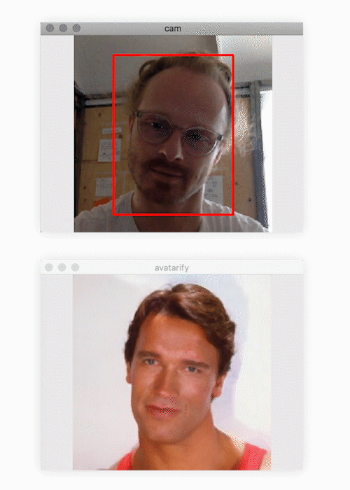

## `place`to `be`

### Stealing identities is a major issue in the use of artificial intelligence. There are AI which imitate voices or writing styles. So-called "deepfakes" can capture faces and map them on other bodies to say and do things that didn't happen. 
### I took this technique and turned it into a playful panorama of our studio. It combines identity-capturing deepfake with the human tendency to see faces in everything and lets the viewer be part of the view.

## `resources`
model for live deepfake: [https://github.com/alievk/avatarify](https://github.com/alievk/avatarify)   
google colab for gpu rendering: [https://colab.research.google.com/github/alievk/avatarify/blob/master/avatarify.ipynb](https://colab.research.google.com/github/alievk/avatarify/blob/master/avatarify.ipynb)   

