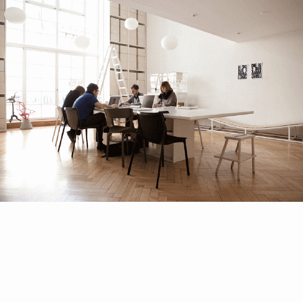

### `Sounds`like `work`

### A highly professionalised design studio looks like a boutique and always needs the right representation. Mostly it is 3-4 people sitting around a table with their Macs in a clean studio while the Bialetti machine is glowing.
### AI naturally doesn't make any noise while working. In order to create the perfect sound atmosphere for studio "AI and I", we collected all the clean studio pics of the Spiekermanns and Stefan Diez of this world. AI then took these pictures and interpreted them into what the images sound like. This transformation is based on a wide dataset of images and their respective ambient noises. I then mixed this sound collection into a 24 hours work ambient.

### `resources`   
Thanks to the following studios for feeding our dataset:  Studio AI and I, Bureau Borsche, Konstantin Grcic, Double Standards, Sagmeister&Walsh, Johannes Erler, Mario Lombardo, Studio Stefan Diez, Nadine Göpfert, Deutsche und Japaner, Neri Oxman, new tendency, Erik Spiekermann, Pentagram, Sascha Lobe, Studio Uebele   
image2sound transfer: [https://melobytes.com/en/](https://melobytes.com/en/)

<!-- There is this highly mystifacted clichee of a professional design studio – a super clean room  -->
