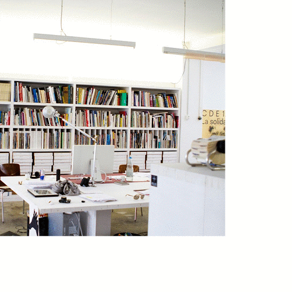

## `Sounds`like `work`

The highly professionalized design studio is like a boutique and always need the right representation. Mostly its 3-4 people sitting around a table with their Macs in a clean studio while the Bialetti machine is glowing.
AI naturally don't make any noise in its work. In order to create the perfect sound atmosphere for studio "AI and I", we consulted all the clean studio pictures of the Sagmeisters and Diez offices around the world. AI then took the pictures and interpreted the picture content in sounds. I then mixed this sound collection into a 24 hours studio ambient.

## `resources`   
Thanks to the following studios for feeding our dataset: Studio AI and I, Bureau Borsche, Konstantin Grcic, Double Standards, Sagmeister&Walsh, Johannes Erler, Mario Lombardo, Studio Stefan Diez, Nadine Göpfert, Deutsche und Japaner, Neri Oxman, new tendency, Erik Spiekermann, Pentagram, Sascha Lobe, Studio Uebele   
image2sound transfer: [https://melobytes.com/en/](https://melobytes.com/en/)

<!-- There is this highly mystifacted clichee of a professional design studio – a super clean room  -->
