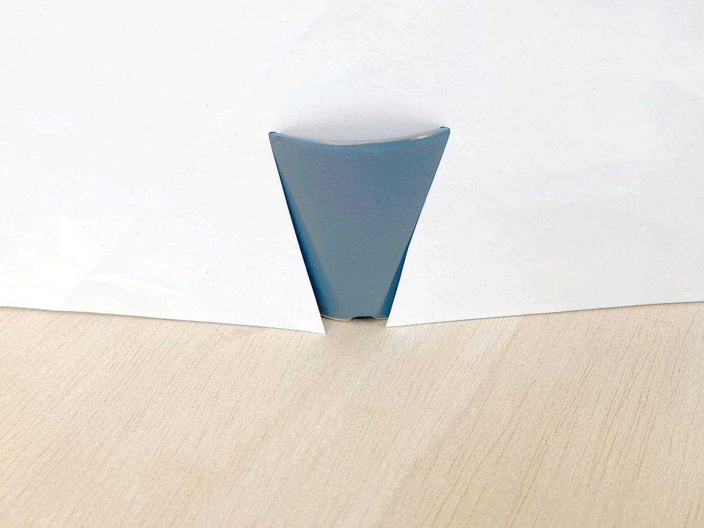
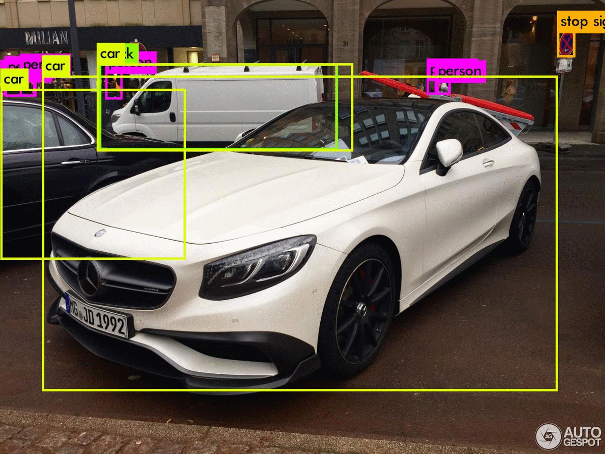
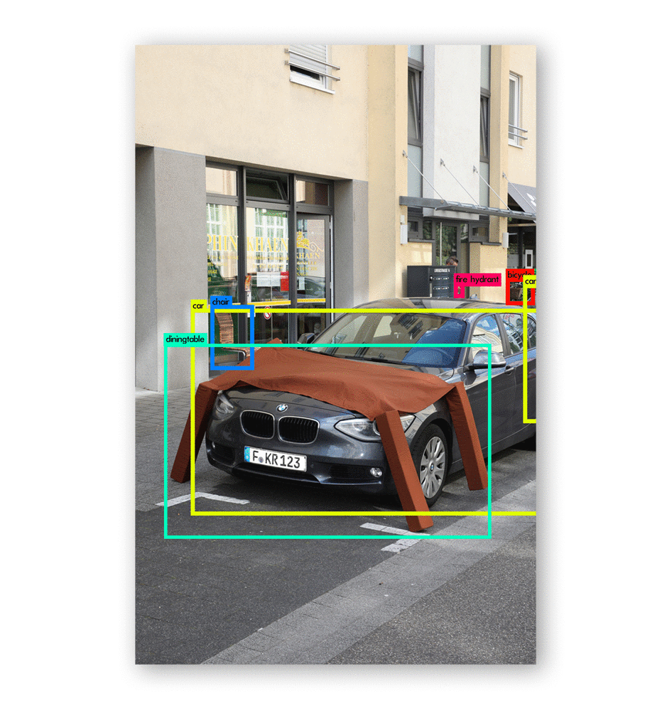
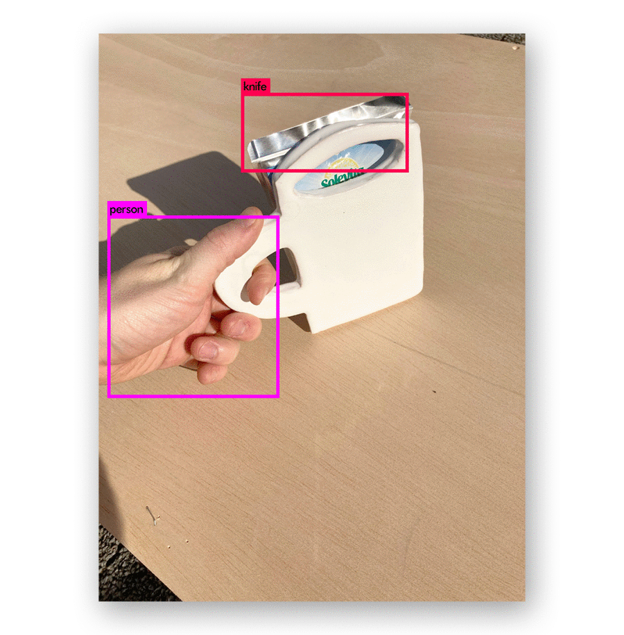
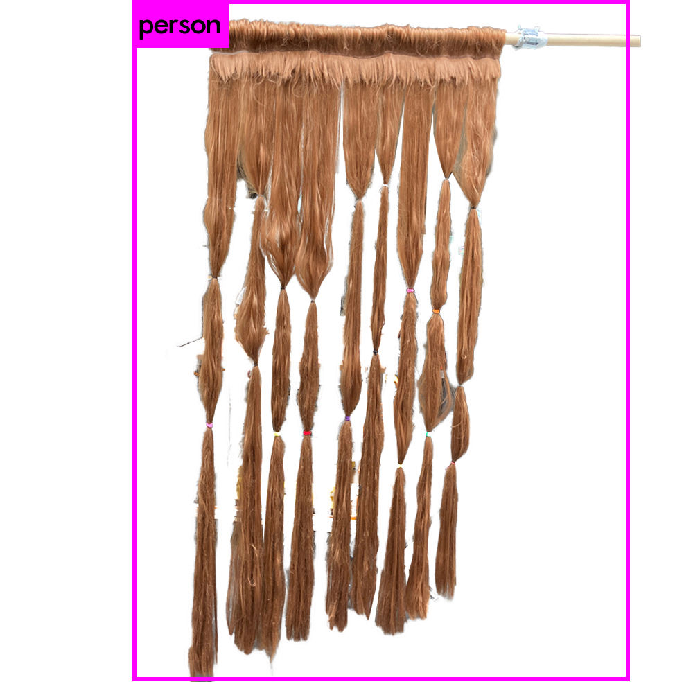

## `Things` for `datasets` 

### `Object detection` is a type of AI that is able to recognises objects in images and videos. The use cases reach from surveillance cameras for monitoring people, to machines for sorting out cucumbers to selfdriving cars that recognize cats on the street. 
### An interesting behaviour of `object detection` is that it recognise some things incredibly good, but some things they ignore completely. This behaviour arises from the fact that the training data still gets labeled by hand which causes faults and blind spots. For example, if the person who labels the data does not know cucumbers, the object detection will never recognise a cucumber as a cucumber (but perhaps as a tree). 

### For the experiment with object detection I chose the 3 classes `person`, `cup` & `table` which are very well recognised and started playling around with them.   I was looking for the limits of recognizability, the in-betweens and the blind spots. The object recognition herefore served as a second perspective to prove or reject my designs.   

   

## `tests`
   
  
   
 
   
 
   

     

### Based on the tests, I designed a series of furnishing objects. All of them are created in a ping pong with `object detection AI` but they differ in their relation to the AI.

## 1. `YOLO table` 
### YOLO table (= *Y*ou *O*nly *L*ook *O*nce) is a table cover in the shape of a table. The cover can make any object a table.   
   

        

## 2. `2D-3D cup`
### For object detections a 2D representation of a cup is enough to be a cup. For humans a cup just makes sense if you can drink out of it. The 2D-3D cup is a compromise for both realities.

          

## 3. `hair curtain` 
### Hairs seem to be a strong feature for the recognition of humans. The hair curtain is the ultimate humanizer.

   

## `resources` 
Darknet YOLO (official website): [https://pjreddie.com/darknet/yolo/](https://pjreddie.com/darknet/yolo/)   
code for yolo github: [https://pjreddie.com/darknet/yolo/](https://pjreddie.com/darknet/yolo/)   

