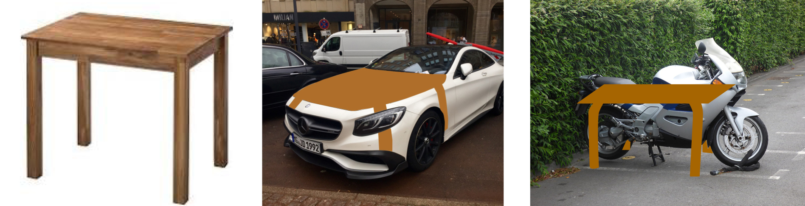
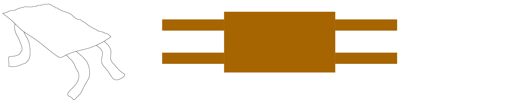
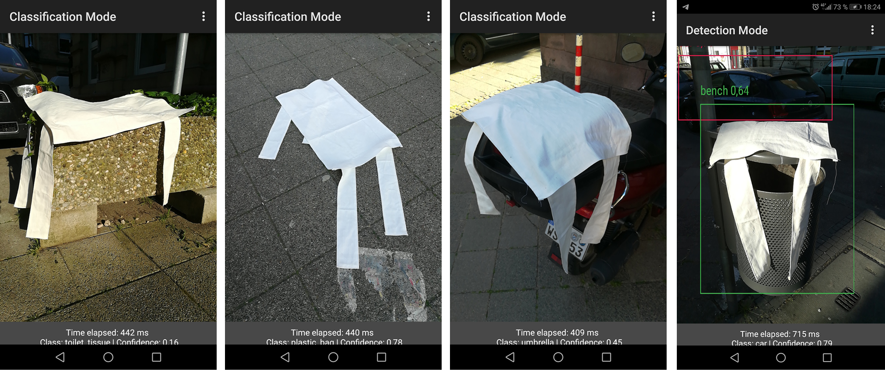

### `T`h`i`n`g`s &nbsp;`f`o`r`&nbsp; d`a`t`a`s`e`t`s` 

### `Object detection` is a type of AI that is able to recognise objects in images and videos. The use cases reach from surveillance cameras for monitoring people, machines for sorting out cucumbers to selfdriving cars that recognize cats on the street. 
### An interesting behaviour of `object detections` is that they recognise some things inccredibly good and some things they ignore completely. This comes from the fact that the training data still gets labeled by hand which causes faults and blind spots. For example, when the person who labels the data does not know cucumbers, the object detection will never recognise a cucumber as a cucumber (but perhaps as a tree). 

### I chose the 3 classes `person`, `cup` & `table` which are very well recognised and started playling around with them.   I was looking for the limits of recognizability, the in-betweens and the blind spots. The object recognition herefor served as a second perspective to prove or reject my designs.

### `tests`
   
     
   
     
   
> bilder tisch   

### `1. YOLO table` 
### (YOLO = you look only once, refers to the object detection AI called 'YOLO'. Because it looks only once on an object the detection works in realtime with 30fps.)   All things are split into categories, classes and sub-classes. I recognized that tables are a well trained class since a lot of things lay on tables and its basically in a lot of indoor sceneries. So how much does it take to be a table?
 
 
  
### The YOLO table is a cover in the shape of a table to cover objects to appear like a table  
(for example a Mercedes table)  
 
 
  
### quick sketch of the cover
 
 

### first tests (failing horribly but also funny)
### it seems that color aswell as context of an object are important factors.

     

### `2. 2D-3D cup`

### `3. hair curtain` 

     
