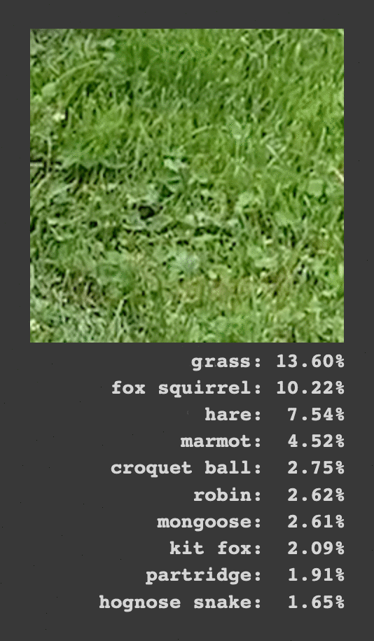
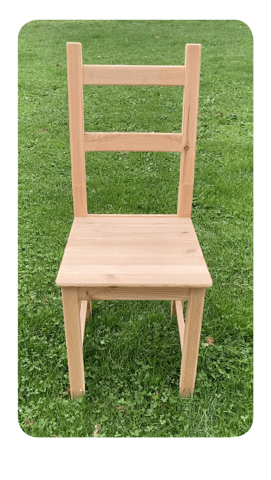

## `Wo`r`d` &nbsp; c`ha`i`r`

### In `word chair` I used a technique called [Activation Atlas](https://distill.pub/2019/activation-atlas/).  The problem with neuronal networks is that they are mostly "black boxes, so we don't know what's going on inside.   For instance, if we take the image of a dog and put it in the network, it says: `100% dog`. We would agree with that, but we don't know what actually happened inside the black box that it says "this is a dog".   
    

### `Activation Atlas` reverse engineer the AI black box to better understand what neuronal networks "think" in certain parts of an image. So they ask:   "What do you see in the first 10x10 Pixels?" "and in the second 10x10 Pixels?" ...and so on. 

   

### I took "Activation Atlas" to make assumptions about a video of a chair on grass. Each videoframe is split up into parts and gets analysed. Afterwards I took the highest predictions and turned them into a word map.   1 frame = 71 x 15 row = 1065 cells   1065 cells x 247 frames = 263055 predictions   
   
   

 
 
 
 

### resources   
full overview of Activation Atlas: [https://distill.pub/2019/activation-atlas/](https://distill.pub/2019/activation-atlas/)     
activation atlas on github: [https://github.com/tensorflow/lucid](https://github.com/tensorflow/lucid)   
Overview of all ImageNet classes: [https://gist.github.com/yrevar/942d3a0ac09ec9e5eb3a](https://gist.github.com/yrevar/942d3a0ac09ec9e5eb3a) ; [http://image-net.org/explore.php](http://image-net.org/explore.php)   
GoogleColabs I used: [https://colab.research.google.com/github/tensorflow/lucid/blob/master/notebooks/activation-atlas/activation-atlas-adversarial.ipynb](https://colab.research.google.com/github/tensorflow/lucid/blob/master/notebooks/activation-atlas/activation-atlas-adversarial.ipynb) ; [https://colab.research.google.com/github/tensorflow/lucid/blob/master/notebooks/building-blocks/ActivationGrid.ipynb](https://colab.research.google.com/github/tensorflow/lucid/blob/master/notebooks/building-blocks/ActivationGrid.ipynb)

